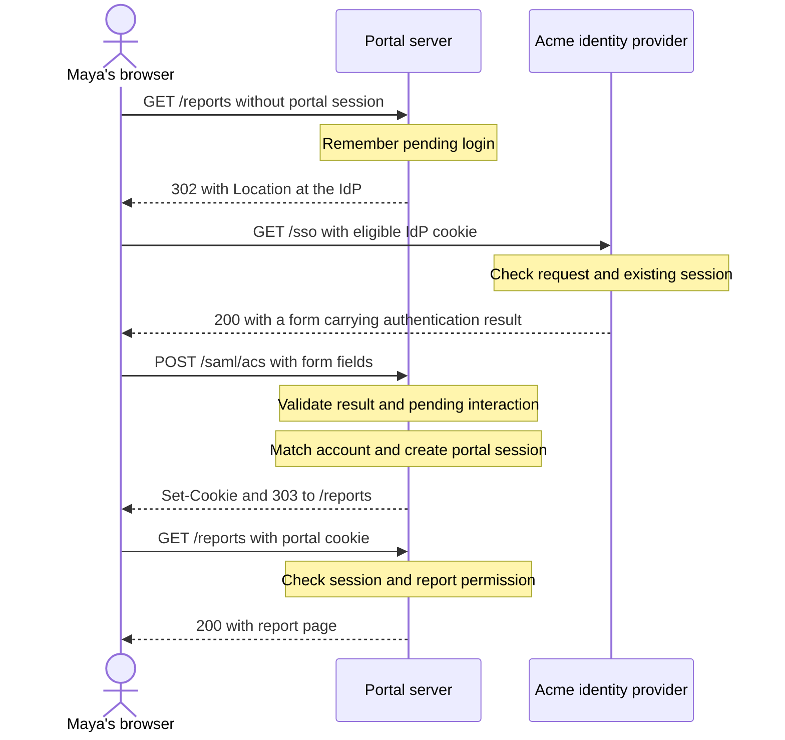

# Following the browser and its sessions

**ID:** FND-002\
**Depth:** Core\
**Prerequisites:** [FND-001](FND-001-login-access-and-account-lifecycle.md).\
**Outcome:** Follow requests across browser and server boundaries, explain how separate sessions are remembered, and distinguish visible traffic from internal processing.

> **Ready.** Reviewed on 2026-09-18. Requests, cookies, and observations are fictional. Message contents and some headers are deliberately omitted. These excerpts are not a deployable login implementation.

## One click, several requests

Maya opens `https://portal.example.com/reports`. She has already signed in to Acme's identity provider, but the portal has no authenticated session for her browser.

The portal needs an authentication result, as you saw in FND-001. Now follow how the browser obtains and delivers it.

First, the browser requests the reports page from the portal. The portal replies with directions to Acme's identity provider. The browser follows those directions and makes a new request there.

The identity provider recognizes its own existing session, checks what the portal is asking for, and prepares an authentication result. It returns a page containing a form. That page submits the form back to the portal through Maya's browser.

The portal checks the result, finds Maya's account, and creates its own session. It sends the browser back to `/reports`. This time, the browser includes the portal's new session cookie. The portal recognizes the session, checks report permission, and returns the page.

Maya may experience this as one short journey. There are several separate HTTP requests, and the browser makes each of them in this example. The identity provider creates the authentication result, but it does not directly call the portal to deliver it.

## The portal replies with directions

An HTTP **request** is a message sent to a server asking it to handle an operation. The server returns a **response**. A response can contain a page, but it can also tell the browser to go somewhere else.

Here is Maya's first request, simplified using readable HTTP/1.1 notation. All requests in this example use HTTPS:

```http
GET /reports HTTP/1.1
Host: portal.example.com
```

`GET` is the method: here it asks for a representation of the reports page. `/reports` is the path, and `Host` identifies the server name. There is no authenticated portal cookie in this first request.

The portal cannot return Maya's private reports yet. It responds:

```http
HTTP/1.1 302 Found
Location: https://idp.example.net/sso
```

The real authentication request includes additional information; it is omitted here so we can follow delivery first.

`302` is a response status code. In this interaction, it tells the browser to follow the address in the `Location` header. A **header** is a named field carrying information about a request or response.

The browser then requests the IdP address. The portal has answered the original request; it has not forwarded it internally to the IdP. A redirect produces another browser request. [MDN: Redirections in HTTP](https://developer.mozilla.org/en-US/docs/Web/HTTP/Guides/Redirections)

The methods and status codes matter. Do not infer that every redirect preserves the previous method and body. Here the original request is a GET. The later `303` response will direct the browser from a form submission to a page retrieval. [RFC 9110, sections 9 and 15.4](https://www.rfc-editor.org/rfc/rfc9110.html)

## The IdP recognizes its own cookie

When Maya signed in earlier, the IdP established a session and supplied its own cookie. The browser can now include that cookie on eligible requests to the IdP:

```http
GET /sso HTTP/1.1
Host: idp.example.net
Cookie: idp_session=FICTIONAL_IDP_HANDLE
```

The IdP uses that handle to find its session record. In this scenario, the session is active and satisfies the requested sign-in policy, so no new interactive sign-in is needed.

The cookie is not sent to every website Maya visits. Browsers decide which cookies are eligible based on their scope and delivery rules. Our example uses separate host-only cookies for `idp.example.net` and `portal.example.com`. The IdP cookie does not accompany a request to the portal. [RFC 6265, sections 3 and 5](https://www.rfc-editor.org/rfc/rfc6265.html)

The detailed cookie attributes become useful when we investigate cross-site login returns in SAML-001. For now, the important distinction is that the browser stores a cookie, while the server decides what session that cookie identifies and whether it is still usable.

## The browser carries the form back

The IdP's successful response contains an HTML form directed at the portal's receiving endpoint, `https://portal.example.com/saml/acs`. An **endpoint** is an address where a service receives a particular kind of request.

The page submits the form through the browser. A page can use script to submit a form automatically; a user can also submit one with a button. We are not depending on Maya typing the authentication result into a form.

The form specifies its destination and uses the POST method. Its fields carry the authentication result in the request body, the data following the headers. A form can submit to another host: the page came from the IdP, but this form's destination is the portal. [HTML Standard: Form submission](https://html.spec.whatwg.org/multipage/form-control-infrastructure.html#form-submission-algorithm)

The resulting request begins like this:

```http
POST /saml/acs HTTP/1.1
Host: portal.example.com
Content-Type: application/x-www-form-urlencoded

FORM_FIELDS_OMITTED
```

The final line is a teaching placeholder, not an actual protocol field. `Content-Type` tells the receiver how the body is represented. The selected form encoding packages fields as names and values; SAML-001 will show the relevant names and message contents. [MDN: POST request method](https://developer.mozilla.org/en-US/docs/Web/HTTP/Reference/Methods/POST)

The browser is carrying sensitive authentication material. Being in a POST body does not make it secret from the browser user or their diagnostic tools. Use only the fictional examples supplied by the course when sharing or inspecting artifacts.

## The portal gives the browser a different cookie

Inside the portal, several decisions now happen: validate the authentication result, associate it with the expected login interaction, resolve Maya's local account, and decide whether that account may establish a session. We are naming those decisions here, not assuming the browser performs them.

For the successful case, the portal creates a fresh server-side session record. Conceptually, its own store contains:

```text
Session handle: FICTIONAL_PORTAL_HANDLE
Local account: Maya's portal account
State: active
```

The handle is deliberately readable fiction. A real session identifier must be generated and protected appropriately; it is not a username that someone can guess or choose. Possession of a usable session identifier can permit access as that session, so it is a credential. [OWASP: Session Management Cheat Sheet](https://cheatsheetseries.owasp.org/cheatsheets/Session_Management_Cheat_Sheet.html)

The portal sends a `Set-Cookie` response header containing its session handle and applicable cookie settings. The browser stores the cookie if permitted. Later it sends the name and value in a `Cookie` request header when eligible. Those are opposite directions: the server sets a cookie; the browser returns it. [RFC 6265, sections 4.1 and 4.2](https://www.rfc-editor.org/rfc/rfc6265.html)

The response also contains a `303 See Other` status and `Location: /reports`. Following that instruction, the browser makes a new GET request:

```http
GET /reports HTTP/1.1
Host: portal.example.com
Cookie: portal_session=FICTIONAL_PORTAL_HANDLE
```

The portal finds the session, checks Maya's permission to read the report, and returns `200 OK` with the report page. The `303` has led to a page retrieval; the browser is not reposting the authentication result to `/reports`.

If the same cookie later refers to an expired or removed server session, merely sending it does not establish authenticated access. The application still checks its session state. [OWASP: Session expiration](https://cheatsheetseries.owasp.org/cheatsheets/Session_Management_Cheat_Sheet.html#session-expiration)

## Put the requests beside the internal work

The selected successful flow can now be read without decoding its authentication message:



The diagram deliberately omits the request fields, correlation mechanism, and cryptographic checks. Those are necessary parts of the complete SAML example, not optional steps to skip in an implementation. [SAML-001](../part-saml/SAML-001-first-sp-initiated-login.md) supplies the fuller exchange.

After successful login, the arrangement is:

| Browser-held value | Sent to in this example | Server-side state it identifies |
|---|---|---|
| IdP cookie | Acme IdP | Maya's IdP session |
| Portal cookie | Employee portal | Maya's portal session |

Neither server borrows the other's session record. Ending one session does not, by this mechanism alone, end the other.

## Not every network call involves the browser

Messages carried through the browser are commonly described as **front-channel** traffic. In the selected login, both the outgoing redirect and returning form POST use that channel.

For contrast, imagine a separate diagnostic operation: the portal backend requests a public status document from `https://idp.example.net/status`. The backend opens its own connection and receives the response. Maya's browser makes no request for that operation, and its cookies are not automatically attached to the backend's call.

That is a **back-channel**, or direct server-to-server, exchange. This fictional status endpoint is only a channel illustration; it is not part of the SAML login or a claim about an Okta endpoint.

There is a third category: the portal's code checks a value or looks up a session internally. That is **internal processing**, not a message to another participant. Internal processing may use implementation dependencies, but it should not be drawn as an IdP call unless such a call actually occurs.

Later, a browser-only application's JavaScript will make some network calls that a server-rendered application would perform on its backend. Those calls are visible in that browser. Label the runtime doing the work instead of assuming that a message type is always invisible.

## What a browser trace can establish

Suppose you inspect this fictional successful trace:

| Request | Observed response |
|---|---|
| GET portal `/reports` | 302 to the IdP |
| GET IdP `/sso` | 200 containing the return form |
| POST portal `/saml/acs` | Set-Cookie and 303 to `/reports` |
| GET portal `/reports`, with portal cookie | 200 containing Maya's report |

You can identify destinations, methods, response status, visible headers, and submitted content. You can see the portal offering a cookie and the browser sending it afterward.

You cannot inspect the portal's internal signature check from these rows. The final report page is evidence that the application granted the request in this scenario, not proof that every security check was correctly implemented.

A `200` alone is weaker evidence still: an application can return a login page or an error page with that status. Read the response and obtain the relevant server-side observations before concluding which internal decision succeeded.

## Predict the next check

The browser shows a POST to the portal, a `303` back to `/reports`, and then another redirect to the IdP. A colleague says, "The authentication message must have a bad signature."

What does the trace establish? What evidence would help distinguish a session-cookie problem from a portal-side rejection?

### Worked answer

The browser submitted the result and followed the portal's instructions, but the attempted page access did not finish as expected. The redirect alone does not identify the reason.

Inspect whether the POST response offered a portal cookie and whether the next eligible request included it. A missing cookie narrows the investigation toward cookie creation, storage, or delivery. It does not by itself explain why it was missing.

If the cookie was sent, obtain the portal's observations for authentication-result validation, session creation, and session lookup. The server might have rejected the result, failed to persist a session, or been unable to resolve the returned handle. Do not infer a signature failure without its validation evidence.

After correcting the supported cause, start a fresh login and verify that the portal establishes a session, the browser returns its cookie, and the permitted report loads. Confirm that the application still denies a report Maya is not allowed to read. Do not disable validation to make the loop disappear.

## Verification note

HTTP, cookie, and form references were checked on 2026-09-18. The selected login is the same fictional deployment as SAML-001, simplified to teach message delivery. The HTTP excerpts omit authentication fields and cookie settings and are not executable test artifacts.

The GitHub-rendered sequence diagram was visually checked on 2026-09-18. Its browser hops, internal notes, and response order agree with the walkthrough. The lesson review found no blocking prerequisite, narrative, or assessment issue.

[Previous: FND-001](FND-001-login-access-and-account-lifecycle.md) | [Part 1](README.md) | [Table of contents](../TABLE-OF-CONTENTS.md)\
[Next: FND-003](FND-003-artifact-creators-and-consumers.md)
